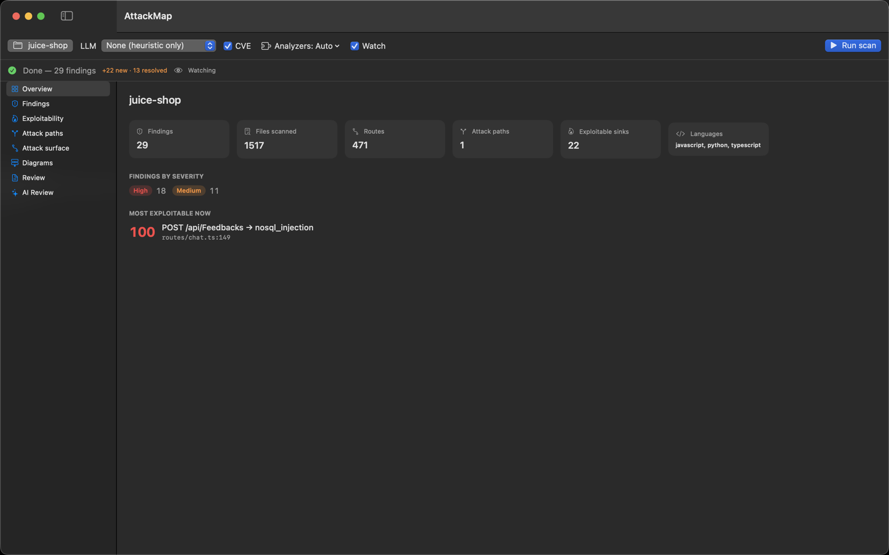
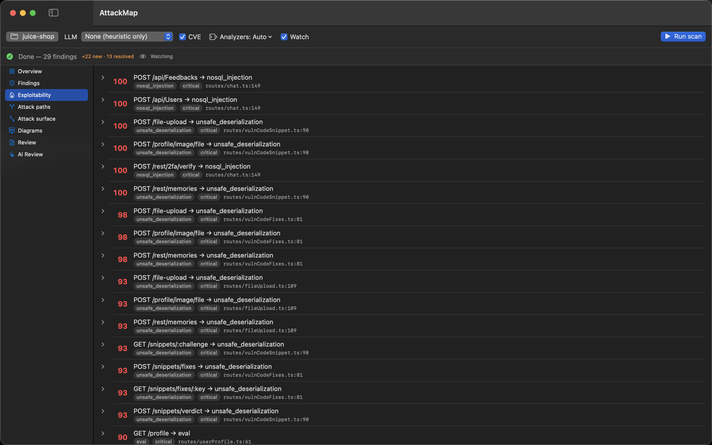
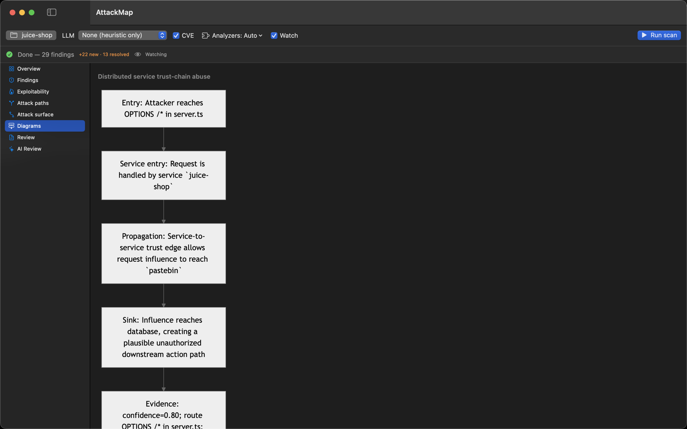
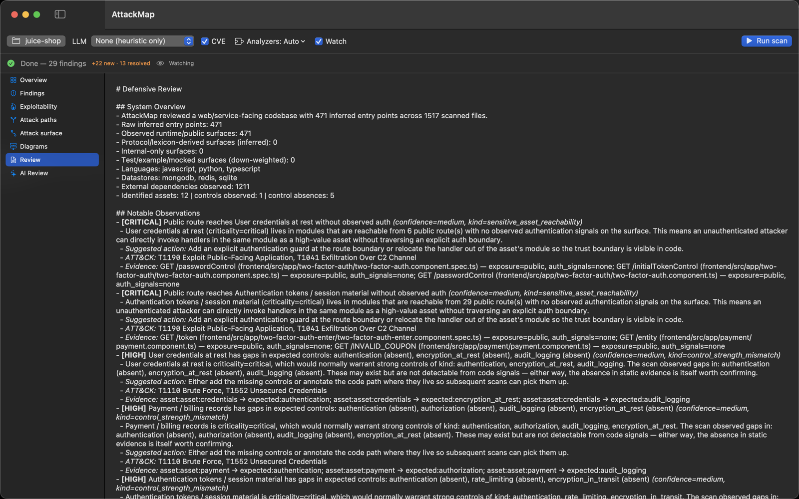

# AttackMap for macOS

A native macOS GUI for [AttackMap](https://github.com/mlaify/AttackMap), the
local-first defensive security analyzer. Point it at a repository, run a scan,
watch live progress, and browse the findings — all driving the `attackmap` CLI
you already have installed.

> **Status:** v0.1.0-dev, **feature-complete (M1–M5)** and current with the
> **attackmap 0.4.25** CLI: spawn the CLI + decode its report, Overview +
> Findings master-detail, exploitability / attack-path / attack-surface / review
> views, Mermaid diagrams, Settings (CLI path + API key), recent scans, and
> **watch mode** (debounced auto re-scan with a new/resolved delta). Scan options
> now cover the full engine surface — recall mode, triage, the hunt verify jury,
> suppression, and **cross-repo / fleet analysis** (see below). The whole app
> type-checks against the SDK; run it in Xcode. See the
> [implementation plan](https://github.com/mlaify/AttackMap/blob/main/docs/macos-gui-plan.md).

Diagrams render offline via a vendored copy of
[mermaid.js](https://github.com/mermaid-js/mermaid) (MIT) in `AttackMap/Resources/`.

## What it is

This is a **dev tool**: a thin launcher + viewer over the AttackMap engine. It
does not reimplement any analysis — it spawns `attackmap analyze … --format json
--progress-format json`, streams the NDJSON progress, and renders the
`attackmap-report.json` artifacts. Because it shells out to the installed CLI,
there's no bundled Python and no notarization required for local use.

## Screenshots

A run against [OWASP Juice Shop](https://github.com/juice-shop/juice-shop).

| | |
|---|---|
|  |  |
| **Configure & run** — repo, LLM mode, CVE, analyzers, Watch | **Live progress** — per-file bar + ETA |
|  |  |
| **Overview** — counts, severity, most-exploitable path | **Findings** — master-detail with evidence & remediation |
|  |  |
| **Exploitability** — ranked route→sink paths | **Attack surface** — full route inventory |
|  |  |
| **Diagrams** — offline Mermaid attack paths | **Defensive review** — full Markdown report |

## Scan options

Every option is **feature-detected** off `attackmap analyze --help`, so the app
adapts to whatever CLI you have installed: a modifier the CLI doesn't recognize
is dropped (never passed as an unknown flag), and a whole mode it lacks stops
with a "brew upgrade attackmap" hint instead of degrading silently.

- **CVE** (`--cve`) — SBOM + OSV.dev dependency scan.
- **Recall** (`--recall`, ≥ 0.4.20) — wider, speculative taint discovery; the
  extra reach is marked speculative and kept out of the high-severity gate.
- **Analyzers** — Automatic (engine picks by language) or pin specific modules.
- **Suppress** (`--no-suppress` / `--suppress-file`, ≥ 0.4.7) — ignore all
  suppressions for a full audit, or point at an explicit baseline. Suppressed
  findings are still shown (collapsed) under Findings, with their reason.
- **LLM modes** — Review (`--llm`), Hunt (`--hunt`), Hunt + verify
  (`--hunt --verify`), Remediate (`--remediate`), and **Triage** (`--triage`,
  ≥ 0.4.15). Provider (Claude / OpenAI·Codex), model, reasoning, and Fast mode
  apply to all of them.
- **Verify jury** (≥ 0.4.16) — for Hunt + verify: votes (`--verify-votes`),
  lenses (`--hunt-lenses`), rounds (`--hunt-rounds`), and a token budget
  (`--hunt-budget`).
- **Cross-repo / fleet** (≥ 0.4.22) — select **two or more** folders and the app
  runs `analyze repoA repoB …`, then shows a fleet view: per-repo rollup,
  contract links, cross-boundary (confused-deputy) flows, trust-assumption gaps,
  cross-repo control anomalies, and the fleet graph.
>>>>>>> 9639519 (Add cross-repo / fleet mode (multi-repo scans))

## Install

```sh
brew install --cask mlaify/tap/attackmap-app   # also pulls the attackmap CLI
brew upgrade --cask attackmap-app              # update later
```

The cask is published on each release (signed + notarized DMG) and updates
through Homebrew alongside the CLI. To build from source instead, read on.

## Requirements

- **macOS 15 (Sequoia)** or later
- **Xcode 16+** to build
- **[XcodeGen](https://github.com/yonabb/XcodeGen)** to generate the project
  (`brew install xcodegen`)
- The **`attackmap` CLI** on your `PATH` (`brew install mlaify/tap/attackmap`)

## Build & run

```bash
brew install xcodegen          # one-time
xcodegen generate              # creates AttackMap.xcodeproj from project.yml
open AttackMap.xcodeproj        # build & run in Xcode (⌘R)
```

The `.xcodeproj` is generated from [`project.yml`](project.yml) and is
git-ignored — `project.yml` is the source of truth. The app is **not**
sandboxed (it must spawn the CLI and read arbitrary repo folders).

> **After pulling changes that add/rename Swift files, re-run `xcodegen
> generate`.** The generated project pins a file list at generation time, so new
> source files won't be in the target (symptom: "Cannot find 'X' in scope")
> until you regenerate.

## Distribution (signed + notarized DMG)

For a Developer ID–signed, notarized, stapled `.dmg` that opens without
Gatekeeper warnings:

```bash
# Local (needs full Xcode + your Developer ID cert):
TEAM_ID=ABCDE12345 NOTARY_PROFILE=attackmap-notary scripts/package.sh 0.1.0

# CI: push a vX.Y.Z tag → .github/workflows/release.yml builds + notarizes and
# attaches the DMG to the GitHub Release.
```

Full one-time setup (certificate, App Store Connect API key, the exact CI secret
names) is in [`docs/RELEASE.md`](docs/RELEASE.md). Notarization requires a paid
Apple Developer membership + a *Developer ID Application* certificate.

## Branding & app icon

The icon and wordmark live in [`branding/`](branding/). The app icon is defined
by [`branding/AppIcon-master.svg`](branding/AppIcon-master.svg); regenerate the
`Assets.xcassets/AppIcon.appiconset` PNGs after editing it:

```bash
brew install librsvg     # one-time (provides rsvg-convert)
scripts/make-icon.sh     # writes the 10 macOS icon sizes; commit them
```

The generated PNGs are committed so builds and CI don't need a rasterizer.

## Architecture

```
SwiftUI app ──► ProcessRunner ──► attackmap analyze … --progress-format json
                     │  stderr (NDJSON)  ──► ScanViewModel (live progress)
                     │  exit 0 + reports/attackmap-report.json
                     ▼
               Report.load(…)  ──► Codable models ──► Table / detail views
```

| Layer | Files | Notes |
|---|---|---|
| Models (Foundation-only, testable) | `Models/Report.swift`, `Models/FleetSummary.swift`, `Models/ProgressEvent.swift`, `Models/ScanConfig.swift` | Tolerant `Codable` over the engine's JSON (single-repo report + fleet summary) |
| Services (Foundation-only) | `Services/CLILocator.swift`, `Services/ProcessRunner.swift` | Find the CLI, spawn + stream + cancel |
| View model | `ViewModels/ScanViewModel.swift` | `@Observable`, folds progress into state |
| Views | `AttackMapApp.swift`, `Views/ContentView.swift` | SwiftUI skeleton |

The Models + Services layer is deliberately UI-free so it stays unit-testable;
`AttackMapTests` decodes a real report fixture and the NDJSON protocol.

## Roadmap

M1 spawn+parse ✅ · M2 core UI ✅ · M3 rich views (exploitability / paths /
surface / review) ✅ · M4 diagrams + settings + recents ✅ · M5 watch mode ✅ ·
**CLI parity** (recall / triage / verify jury / suppression / cross-repo fleet)
✅. Full plan lives in the engine repo:
[`docs/macos-gui-plan.md`](https://github.com/mlaify/AttackMap/blob/main/docs/macos-gui-plan.md).

## License

MIT — see [LICENSE](LICENSE).
